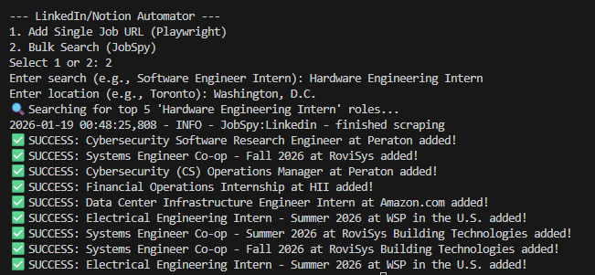

# LinkedIn-to-Notion Job Tracker 🚀

**Status:** 🚧 Work in Progress - Bulk search and Notion integration functional.

A Python-based automation tool designed to streamline the internship search process. This utility automates job discovery and tracking by scraping data from LinkedIn and Indeed, saving key details directly to a private Notion database.

## 📺 Final Result
This dashboard aggregates all discovered jobs for centralized tracking and status management.


## 🛠️ How It Works
1. **Hybrid Discovery**: Supports both specific LinkedIn URL scraping via **Playwright** and keyword-based bulk searching via **JobSpy**.
2. **Notion Integration**: Communicates with the Notion API to automate database entries and management.
3. **Resilient Architecture**: Implements specialized error handling to bypass SDK-level attribute limitations, ensuring reliable data delivery.

### Terminal Output
Evidence of the script successfully executing a bulk search and populating the Notion database.


## 📂 Technical Stack
* **Language**: Python 3.11 (Conda Environment)
* **Search Engine**: Python-JobSpy (LinkedIn & Indeed Aggregator)
* **Web Scraping**: Playwright (Chromium)
* **Database/API**: Notion-Client SDK
* **Environment Management**: Anaconda & Python-Dotenv

## ⚙️ Installation & Setup

### 1. Notion Setup
1. Create a **Notion Database** with these specific properties:
   * `Name`: Title type
   * `Company`: Select type
   * `Status`: Select type (Manually add an option named "To Apply")
   * `Link`: URL type
2. Create an Internal Integration at [Notion Developers](https://www.notion.so/my-integrations).
3. Connect your integration to the database via the **"Connect to"** menu in database settings.

### 2. Local Setup (Conda)
```powershell
# Create a stable environment
conda create -n job_tracker python=3.11 -y
conda activate job_tracker

# Install dependencies
pip install python-jobspy playwright notion-client python-dotenv pandas
playwright install chromium
```
### 3. Environment Variables
Create a .env file (this is ignored by Git for security) and add your keys:
```bash
NOTION_TOKEN=your_notion_secret_here
DATABASE_ID=your_database_id_here
```
### Usage
Run the script and provide a LinkedIn Job URL when prompted:
```PowerShell
.\.venv\Scripts\python.exe main.py
```
## 🗺️ Roadmap

- [x] **Phase 1: Scraper Foundation**
  - Implement **Playwright** core logic to handle LinkedIn's dynamic rendering.
  - Research and select resilient CSS selectors for Job Title, Company, and Location.

- [x] **Phase 2: Notion API Integration**
  - Establish secure connection using `notion-client` and `.env` secrets.
  - Develop `add_to_notion` logic with a fail-safe for library-level attribute errors.

- [x] **Phase 3: Bulk Search Automation**
  - Integrated `python-jobspy` 
  - Implemented a loop to automatically populate the top 10 results into the tracker.

- [ ] **Phase 4: AI Enrichment**
  - Integrate an LLM (Gemini or GPT) to parse job descriptions.
  - Automatically extract technical requirements such as **C++**, **Verilog**, and **Python**.

- [ ] **Phase 5: Deployment & Scheduling**
  - Configure a local cron job or GitHub Action for daily automated runs.
  - Add logic for "Date Added" tracking and salary range extraction.