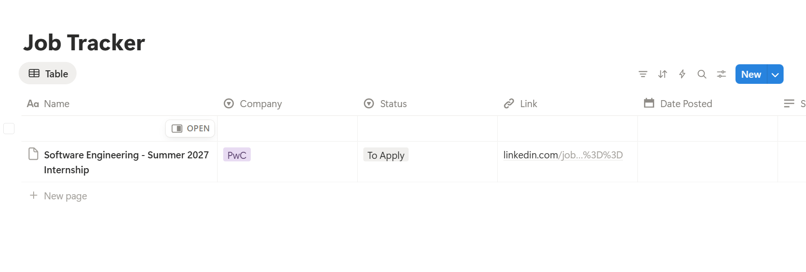
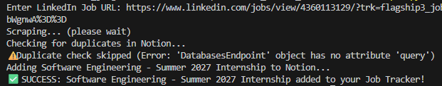

# LinkedIn-to-Notion Job Tracker 🚀

**Status:** 🚧 Work in Progress - Core scraper and Notion integration functional.

A Python-based automation tool designed to streamline the internship search process. This utility scrapes LinkedIn job postings and saves key details directly to a private Notion database, bypassing expensive "per-run" automation platforms.

## 📺 Final Result
This is the central dashboard where all scraped jobs are aggregated for tracking and status management.

## 🛠️ How It Works
1. **Dynamic Scraping**: Uses **Playwright** to navigate LinkedIn and extract job titles and company names.
2. **Notion Integration**: Communicates with the Notion API to manage data entries.
3. **Fail-Safe Design**: Includes error handling to ensure jobs are added even if secondary features (like duplicate checking) encounter library limitations.

### Terminal Output
Evidence of the script successfully scraping a job and pushing it to the Notion database.


## 📂 Technical Stack
* **Language**: Python 3.10+
* **Scraping**: Playwright (Chromium)
* **Database/API**: Notion-Client SDK
* **Environment Management**: Python-Dotenv & Virtual Environments

## ⚙️ Installation & Setup

### 1. Notion Setup
1. Create a **Notion Database** with these specific properties:
   * `Name`: Title type
   * `Company`: Select type
   * `Status`: Select type (Add an option named "To Apply" manually)
   * `Link`: URL type
2. Create an Internal Integration at [Notion Developers](https://www.notion.so/my-integrations).
3. In your database settings, use the **Connect to** feature to link your integration.

### 2. Local Setup
```bash
# Clone the repository
git clone <your-repo-url>
cd linkedin_notion_tool

# Initialize virtual environment
python -m venv .venv
.\.venv\Scripts\activate

# Install dependencies
pip install -r requirements.txt
python -m playwright install chromium
```
### 3. Environment Variables
Create a .env file (this is ignored by Git for security) and add your keys:
```bash
NOTION_TOKEN=your_notion_secret_here
DATABASE_ID=your_database_id_here
```
### Usage
Run the script and provide a LinkedIn Job URL when prompted:
```PowerShell
.\.venv\Scripts\python.exe main.py
```
## 🗺️ Roadmap

- [x] **Phase 1: Scraper Foundation**
  - Implement **Playwright** core logic to handle LinkedIn's dynamic rendering.
  - Research and select resilient CSS selectors for Job Title, Company, and Location.

- [x] **Phase 2: Notion API Integration**
  - Establish secure connection using `notion-client` and `.env` secrets.
  - Develop `add_to_notion` logic with a fail-safe for library-level attribute errors.

- [ ] **Phase 3: Bulk Search Automation**
  - Integrate `python-jobspy` to allow keyword-based searches (e.g., "Software Engineer Intern").
  - Implement a loop to automatically populate the top 10 results into the tracker.

- [ ] **Phase 4: AI Enrichment**
  - Integrate an LLM (Gemini or GPT) to parse job descriptions.
  - Automatically extract technical requirements such as **C++**, **Verilog**, and **Python**.

- [ ] **Phase 5: Deployment & Scheduling**
  - Configure a local cron job or GitHub Action for daily automated runs.
  - Add logic for "Date Added" tracking and salary range extraction.